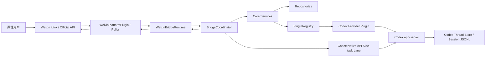
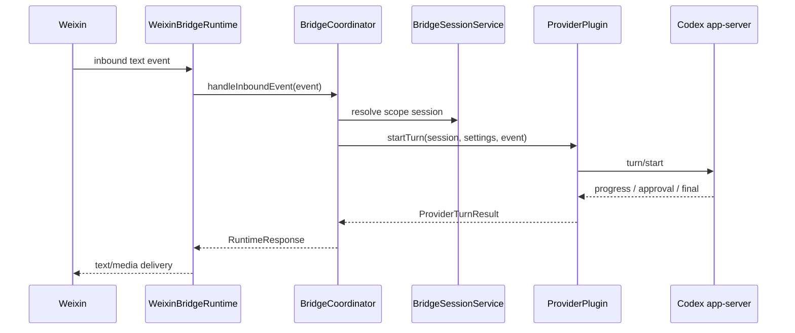

# CodexBridge Architecture and Design

本文是 CodexBridge 的总架构与设计基准。它的目标不是替代每个子系统的细节文档，而是给后续开发提供一套稳定的对齐规则：新增功能、修复缺陷、重构模块时，都应先判断是否仍然符合本文定义的边界、数据流和不变量。

## 1. Product Definition

CodexBridge 是一个以 Codex 为执行引擎的多平台桥接系统。当前产品中心是：

- 平台入口：微信个人会话。
- 执行引擎：Codex app-server。
- 核心体验：用户在微信中通过文本消息和 slash command 使用 Codex 原生能力。
- 长期方向：平台可替换，provider profile 可扩展，但 Codex thread state 始终是主对话的事实来源。

当前仓库里存在多个方向：

- `src/`：当前活跃的 CodexBridge 主线。
- `packages/codex-native-api`：保留并局部抽取的本地 Codex API 能力。
- `packages/codex-gateway`：暂停中的 OpenAI-compatible gateway 实验。
- `packages/mission-control`：暂停中的长任务监督实验。
- `codex/`：本地拷贝的 Codex 源码，仅用于分析，不属于 CodexBridge 主线提交范围。

Phase 1 的实际产品闭环是：微信 -> CodexBridge -> Codex app-server -> 微信。

## 2. Architectural Principles

### 2.1 Source of truth

主对话的事实来源是 Codex thread，而不是微信消息、Bridge 本地缓存或平台上下文 token。

Bridge 本地状态只负责：

- 将平台 scope 绑定到 bridge session。
- 记录 session settings、thread metadata、automation、assistant records 等桥接层状态。
- 在当前进程中追踪 active turn、pending approval、artifact delivery。
- 将 provider 输出可靠投递回平台。

### 2.2 Platform isolation

平台插件只负责平台协议和消息交付。平台插件不得决定 provider routing，不得直接修改 Codex thread state，也不得拥有 canonical conversation state。

### 2.3 Provider isolation

Provider 插件只负责把 Bridge 的 provider contract 映射到实际执行引擎。Codex provider 不应知道微信消息格式；OpenAI-compatible provider 不应污染 Codex 原生 thread 语义。

### 2.4 Session identity

一个真实主对话 session 由以下二元组确定：

- `providerProfileId`
- `codexThreadId`

`bridgeSessionId` 是 CodexBridge 内部对该二元组的本地包装。平台 scope 只能绑定到 bridge session，不直接拥有 thread。

### 2.5 Provider profile switching

切换 provider profile 必须创建或绑定到另一个 bridge session，不能把不同 provider profile 的请求混进同一个 Codex thread。

### 2.6 Text-first UX

微信端不依赖按钮作为核心功能入口。所有关键行为必须能用文本命令完成，例如 `/helps`、`/status`、`/threads`、`/open`、`/goal`、`/allow`、`/deny`、`/stop`。

### 2.7 No silent user path

所有用户触发的命令都必须有微信可见结果。尤其是长任务、原生 goal turn、approval pending、resume fallback、delivery failure，不能后台运行而微信完全无消息。

## 3. System Context



核心链路是同步语义上的一条主链：

1. 平台接收消息。
2. Runtime 归一化并串行化 scope 内工作。
3. Coordinator 解析命令或普通消息。
4. Core services 解析或创建 bridge session。
5. Provider plugin 调用 Codex app-server。
6. Runtime 将 progress、approval、final、artifact 交付回微信。

## 4. Repository Layout

```text
src/
  cli.ts                         # CLI entrypoint: weixin login/serve, codex native-api, cleanup
  runtime/                       # Runtime bootstrap, plugin registry, Weixin event loop
  core/                          # Session, coordinator, active turns, automations, assistant records, agent jobs
  platforms/
    weixin/                      # Weixin account, poller, iLink transport, formatting, media delivery
    telegram/                    # Telegram plugin skeleton/tests
  providers/
    codex/                       # Codex app-server client/plugin, native goal, native API, auth, review
    openai_compatible/           # Responses adapter and model capability translation
    openai_native/               # Native OpenAI provider placeholder
  services/                      # External data services such as Weibo hot search
  store/
    file_json/                   # Persistent JSON repositories
    in_memory/                   # Test/runtime in-memory repositories
  types/                         # Platform, provider, repository, core contracts
  i18n/                          # User-facing strings

test/                            # CodexBridge tests
packages/                        # Paused or extracted package workstreams
docs/                            # Architecture, usage, todo, incident notes
```

## 5. Runtime Composition

`createCodexBridgeRuntime()` wires the main object graph:

- `PluginRegistry`
- repositories
- `SessionRouter`
- `BridgeSessionService`
- `AutomationJobService`
- `AgentJobService`
- `AssistantRecordService`
- `ActiveTurnRegistry`
- `BridgeCoordinator`

`src/cli.ts weixin serve` adds deployment concerns:

- account store under the CodexBridge state directory
- file-backed repositories
- Codex provider profiles from environment
- Weixin platform plugin
- Codex provider plugins
- optional embedded Codex Native API service
- serve lock to prevent duplicate polling of the same Weixin account

The runtime graph should remain dependency-injected. Tests should prefer in-memory repositories and mock provider/platform plugins over live network calls.

## 6. Core Domain Model

### 6.1 ProviderProfile

Represents a configured backend profile. Important fields:

- `id`
- `providerKind`
- `displayName`
- `config`

Provider profile IDs are stable routing keys. Provider kind selects the plugin implementation.

### 6.2 BridgeSession

Represents one Codex-backed conversation under one provider profile:

- `id`
- `providerProfileId`
- `codexThreadId`
- `cwd`
- `title`

Bridge sessions are the canonical bridge-level conversation units.

### 6.3 PlatformBinding

Maps platform scope to bridge session:

- `platform`
- `externalScopeId`
- `bridgeSessionId`

Example:

```text
weixin:o9cq...@im.wechat -> bridge_session_a
telegram:-100xx::1417     -> bridge_session_a
```

### 6.4 SessionSettings

Stores session-level runtime settings:

- `model`
- `reasoningEffort`
- `serviceTier`
- `collaborationMode`
- `personality`
- `accessPreset`
- `approvalPolicy`
- `sandboxMode`
- `locale`
- `metadata`

Settings are bound to bridge session, not platform scope.

### 6.5 ThreadMetadata

Stores Bridge-local metadata for provider threads:

- alias
- archive state
- pin state

This augments provider thread lists without replacing provider data.

### 6.6 ActiveTurnRegistry

Tracks currently running turns in the Bridge process:

- scope
- bridge session
- provider profile
- thread id
- turn id
- interrupt flags
- pending approvals
- artifact delivery state

This is process-local operational state. It is required for `/stop`, `/allow`, `/deny`, approval prompts, and artifact follow-up. It is not a persisted source of truth.

### 6.7 AssistantRecord, AutomationJob, AgentJob

These are Bridge-owned workflows:

- assistant records: user logs, todos, reminders, notes
- automation jobs: scheduled recurring tasks
- agent jobs: longer supervised jobs, currently connected to Mission Control concepts

They may use Codex for parsing or execution, but their lifecycle is owned by CodexBridge repositories.

## 7. Plugin Contracts

### 7.1 PlatformPluginContract

Platform plugins must implement:

- `start()`
- `stop()`
- `normalizeInboundEvent()`
- `buildTextDeliveries()`

Optional capabilities:

- `sendText()`
- `sendTyping()`
- `sendMedia()`
- `getStatus()`

Platform plugins own protocol details, not business decisions.

### 7.2 ProviderPluginContract

Provider plugins must implement:

- `startThread()`
- `readThread()`
- `listThreads()`
- `startTurn()`

Important optional capabilities:

- `resumeThread()`
- `interruptTurn()`
- `respondToApproval()`
- `startReview()`
- `getThreadGoal()`
- `setThreadGoal()`
- `setThreadGoalAndFollow()`
- `clearThreadGoal()`
- model, usage, skills, plugins, login, reconnect, instructions APIs

The Bridge core may check optional functions, but must degrade visibly when a provider does not support a feature.

## 8. Main Message Flow

### 8.1 Existing bound scope



### 8.2 First message without binding

1. Runtime receives event.
2. Coordinator asks `BridgeSessionService.resolveOrCreateScopeSession()`.
3. Service starts a provider thread.
4. Service saves bridge session and platform binding.
5. Coordinator starts the first turn.

### 8.3 `/new`

`/new` creates a new bridge session for the current scope. It should not mutate the old session. The old session remains available through `/threads`, `/open`, or search.

### 8.4 `/open`

`/open` binds the current scope to an existing bridge session or provider thread, then returns a short preview. It is a rebinding operation, not a new turn by itself.

### 8.5 Provider recovery

When a turn fails because the provider thread is cold or missing from the current app-server process, Bridge may call `resumeThread()` if the provider supports it. If resume fails and recovery rules allow it, Bridge can create a replacement session and visibly tell the user.

## 9. Native `/goal` Design

The `/goal` command is special because Codex native goal can auto-start or resume turns outside a normal Bridge `startTurn()` request.

Required behavior:

1. Bridge registers a listener for native `turn/started` before calling `thread/goal/set`.
2. Bridge calls native `thread/goal/set`.
3. If a native goal turn starts, Bridge captures its `turnId`.
4. Bridge writes the native turn into `ActiveTurnRegistry`.
5. Bridge forwards progress, approval requests, and final output to Weixin.
6. If no native turn is captured and the goal is active, Bridge reads thread status.
7. If the thread is `notLoaded` or status is unknown, Bridge calls `thread/resume` and keeps listening.
8. If resume starts a native goal turn, Bridge follows that turn exactly like the hot-thread case.
9. Every `/goal` path must produce a visible Weixin response.

This design intentionally avoids `suppressAutoTurn` for `/goal set/resume`, because suppressing the native turn breaks equivalence with Codex native goal behavior. Instead, Bridge follows the native turn and brings it under Weixin control.

### Hot vs cold thread

- Hot thread: the current Codex app-server already has the thread loaded. `thread/goal/set` can trigger `apply_external_goal_set()` and auto-start a turn immediately.
- Cold thread: the thread exists in persisted storage but is not loaded in the current app-server process. `thread/goal/set` may only update goal state. Bridge must call `thread/resume` to materialize it and allow native goal continuation.

### Equivalence goal

The Bridge behavior should be equivalent to Codex native `/goal` at the app-server level:

- use native goal RPCs
- allow native auto-start/resume semantics
- follow native turn output
- preserve native approval requests
- let native goal completion update goal state

Bridge only adds platform delivery, active-turn tracking, and visible acknowledgements.

## 10. Approval and Stop Semantics

Approvals are scoped to active turns. A provider approval request must be registered in `ActiveTurnRegistry` before the user can respond with `/allow` or `/deny`.

Rules:

- `/allow 1`, `/allow 2`, `/deny` target the current scope's active turn.
- If there is no pending approval, the user must receive a visible "no pending approval" response.
- Approval prompt delivery failure must not crash the turn.
- `/stop` marks the active turn interrupted and dispatches provider interruption if `threadId` and `turnId` are known.
- Native goal turns captured by `/goal` must be registered exactly like normal turns, so `/stop` and approval behavior stay consistent.

Weixin long-running commands that can block polling, especially `/goal` and `/review`, must be scheduled in the background so `/allow` and `/stop` can still be received while the native turn is running.

## 11. Weixin Runtime and Delivery

`WeixinBridgeRuntime` owns the operational event loop:

- starts/stops the platform plugin
- polls inbound messages
- normalizes events
- serializes per-scope work
- schedules long-running commands
- sends typing indicators
- delivers progress/final text
- delivers media artifacts
- runs automation sweeps and cleanup timers
- handles delivery failures without crashing the process

Delivery is a separate concern from provider execution. Provider result quality and Weixin delivery reliability must be debugged separately.

Delivery rules:

- user-visible commands cannot be silent
- final output should preempt pending preview output
- delivery failures should return structured results
- retry should be chunk-oriented
- successful prefixes should not be blindly resent
- rate-limit notices should be best-effort and visible when possible

## 12. Codex App-Server State Boundary

CodexBridge may share a `codexThreadId` with Codex app UI, but running state is not automatically shared across independent app-server processes.

Persisted state:

- session JSONL/history
- thread metadata from Codex thread store
- final assistant output after it is written
- goal state stored by Codex

Process-local state:

- current live turn
- `thread.status` active/idle/notLoaded as observed by one app-server process
- pending approval requests
- streamed progress
- active connection subscriptions
- Bridge `ActiveTurnRegistry`

Therefore:

- Codex app can load the same thread file and later see persisted results.
- Codex app does not automatically see a Weixin-started live turn unless it connects to the same app-server instance or explicitly resumes/attaches in a way that receives live notifications.
- Loading a thread file through `thread/read` can replay history but does not attach a live listener.
- `thread/resume` can materialize a thread in the current app-server and subscribe the current connection to future events for that process.

This boundary is central to `/goal`, `/stop`, approval, and progress behavior.

## 13. Codex Provider Design

The Codex provider plugin is the main execution provider. It wraps `CodexAppClient`, which launches or connects to Codex app-server and maps JSON-RPC methods into the provider contract.

Responsibilities:

- start and read threads
- list/archive/unarchive threads
- start turns
- resume threads
- interrupt turns
- respond to approvals
- follow native goal turns
- expose model, usage, skills, plugins, and experimental features
- normalize Codex output into `ProviderTurnResult`

Transport:

- default app-server transport is WebSocket
- stdio is retained as a fallback/compatibility mode
- Windows command launching must avoid WindowsApps shims that cannot be executed by shell

The provider must not know about Weixin delivery details. It may emit progress and approval callbacks; runtime/coordinator decide how those are displayed.

## 14. OpenAI-Compatible Provider Design

OpenAI-compatible provider support exists to allow Codex-style execution against compatible model APIs through a local Responses adapter.

Design rules:

- provider-specific behavior belongs in data: capabilities, payload rules, thinking policy, model catalog
- executor code should stay generic
- provider profiles carry credentials/base URL/default model
- switching into an OpenAI-compatible profile creates a separate bridge session
- OpenAI-compatible experiments must not redefine the main Weixin + Codex path

Current built-in compatible families include DeepSeek, MiniMax, Qwen, OpenRouter, Kimi, Gemini, iFlow, and catalog-driven variants.

## 15. Codex Native API and Side-Task Lane

Codex Native API is an isolated execution surface over logged-in local Codex. It should support localhost API consumers and Bridge-internal side tasks without polluting the main Weixin conversation thread.

Design rules:

- main conversation lane remains direct Codex app-server integration
- isolated side-task lane may use Codex Native API
- `previous_response_id` continuation is local to the native API service process unless a persistence layer explicitly changes that contract
- continuation must remain pinned to provider/account affinity
- native API failures should degrade to direct native isolated execution only when the caller explicitly allows fallback

Do not use the native API lane as a hidden replacement for the main conversation lane.

## 16. Automations, Assistant Records, and Agent Jobs

These workflows are Bridge-owned higher-level features.

### Assistant records

`/as`, `/log`, `/todo`, `/remind`, and `/note` create or manage structured personal records. Codex may help parse natural language, but final persistence is in the assistant record repository.

### Automations

`/auto` creates scheduled background jobs tied to a platform scope and bridge session. The scheduler runs from `WeixinBridgeRuntime` and should deliver results back to the originating chat.

### Agent jobs

Agent jobs are longer-running structured work items. The Mission Control package is currently paused, but Bridge still contains integration seams and repositories. New work should not expand Mission Control scope unless that workstream is explicitly resumed.

## 17. Storage

Runtime state defaults to file-backed JSON repositories under the CodexBridge state directory:

```text
~/.codexbridge/
  runtime/
    bridge_sessions.json
    platform_bindings.json
    session_settings.json
    provider_profiles.json
    thread_metadata.json
    automation_jobs.json
    agent_jobs.json
    assistant_records.json
    weixin-serve.lock
  weixin/
    accounts/
  assistant/
    attachments/
```

Tests should use in-memory repositories unless they explicitly validate file-json behavior.

Repository implementations must preserve the interface contracts in `src/types/repository.ts`. New persistent data should get:

- a domain type
- a repository interface
- in-memory implementation
- file-json implementation
- focused tests

## 18. Command Design

Slash commands live in `BridgeCoordinator`.

Rules:

- all commands must be discoverable through `/helps`
- command help should be text-first and short enough for Weixin
- commands should prefer indexes and aliases over raw thread IDs
- destructive commands require confirmation or clear intent
- commands that begin long-running native work must create visible acknowledgement before or during execution
- platform-specific wording belongs in i18n strings, not business logic

Long-running command classes:

- native goal follow
- review
- agent job execution
- automation sweep
- provider reconnect/retry operations

These must not block Weixin polling in a way that prevents `/allow`, `/deny`, or `/stop`.

## 19. Error Handling

Errors should be categorized by layer:

- platform receive/delivery errors
- command parse errors
- session binding errors
- provider launch/connect errors
- provider runtime errors
- approval/interrupt errors
- repository persistence errors
- side-task/native API errors

User-visible errors should be concise and actionable. Debug logs can contain deeper details such as JSON-RPC method names, thread IDs, turn IDs, delivery chunk indices, and provider transport state.

Provider errors must not be misreported as Weixin delivery failures, and Weixin delivery failures must not be misreported as provider final-output failures.

## 20. Observability

Runtime logs should make these questions answerable:

- Which platform scope sent the message?
- Which bridge session and provider profile handled it?
- Which Codex thread and turn were used?
- Was the thread hot, cold, resumed, or replaced?
- Did a native goal turn start?
- Were approval requests delivered and resolved?
- Was `/stop` dispatched?
- Did provider execution finish?
- Did Weixin delivery succeed or fail?

Logs should avoid exposing secrets, auth tokens, or full sensitive file contents.

## 21. Testing Strategy

Test layers:

- unit tests for pure parsing/formatting/capability logic
- repository contract tests for in-memory and file-json stores
- provider client tests with mocked app-server RPCs
- coordinator tests with mocked provider/platform services
- runtime tests for Weixin polling, scheduling, delivery, approval, and final handling
- opt-in live smoke tests only when explicitly enabled by environment variables

Recommended CodexBridge-only regression set for `/goal` and Weixin runtime:

```bash
node ./scripts/test.mjs test/providers/codex/app_client.test.ts test/providers/codex/plugin.test.ts test/core/bridge_coordinator.test.ts test/runtime/weixin_bridge_runtime.test.ts
```

Full main-repo test command:

```bash
npm test
```

Package-specific tests are separate and should not be assumed part of a CodexBridge-only change unless that package is touched.

## 22. Development Guardrails

### 22.1 Active code boundary

For current mainline work, prefer changes in:

- `src/`
- `test/`
- `docs/`
- root config/scripts when required

Do not modify copied `codex/` Rust source as part of CodexBridge fixes unless the task explicitly becomes an upstream Codex change.

### 22.2 Adding a platform

Add a platform by implementing `PlatformPluginContract` and runtime wiring. Do not add platform-specific state to core unless the state is genuinely cross-platform.

### 22.3 Adding a provider

Prefer adding a provider profile or capability data over adding a new provider class. Add a new provider class only when the execution protocol truly differs.

### 22.4 Adding a command

Every new command needs:

- parser/dispatcher path
- visible success and failure messages
- `/helps` entry
- i18n strings
- tests for happy path and unsupported/error path

### 22.5 Adding a persistent domain object

Every new object needs:

- type definition
- repository contract
- in-memory repo
- file-json repo
- service-level API
- migration/backward-compatibility behavior if the JSON shape evolves

### 22.6 Long-running work

Long-running work must:

- be visible to the user
- avoid blocking Weixin polling
- register active turns when provider turns are controllable
- support `/stop` where possible
- surface approvals promptly
- clean up active-turn state on completion, interruption, or failure

## 23. Architectural Decision Rules

When deciding where code belongs:

- If it parses platform protocol, put it in `platforms/<platform>`.
- If it parses user commands or manages bridge workflows, put it in `core`.
- If it talks to Codex app-server or provider APIs, put it in `providers`.
- If it runs the polling/delivery loop, put it in `runtime`.
- If it persists domain records, put it behind `types/repository.ts` and `store`.
- If it is product/user wording, put it in `i18n`.
- If it is a paused package workstream, do not expand it from a mainline fix unless explicitly requested.

When in doubt, keep the new code closer to the existing owner of the behavior and add a small contract instead of reaching across layers.

## 24. Known Architectural Boundaries

These are intentional constraints, not bugs:

- Same `codexThreadId` does not imply live turn state is synchronized across app-server processes.
- Weixin context tokens are delivery/protocol helpers, not conversation truth.
- `ActiveTurnRegistry` is not persisted and should not be treated as historical state.
- Native goal follow is a Bridge control layer around Codex-native behavior, not a separate goal implementation.
- OpenAI-compatible provider sessions must not reuse Codex-native thread IDs.
- Native API side tasks should not pollute the main bridge session unless explicitly merged.

## 25. Documentation Map

This document is the top-level architecture baseline. More focused documents:

- [Core architecture](./codexbridge-core-architecture.md)
- [Concepts and code structures](./codexbridge-concepts-and-code-structures.md)
- [Foreground/background thread design](./foreground-background-thread-design.md)
- [Foreground/background thread implementation plan](./foreground-background-thread-implementation-plan.md)
- [Codex Native API](./codex-native-api.md)
- [Weixin delivery best practice](./weixin-delivery-best-practice.md)
- [Mission Control architecture](./mission-control.md)
- [Weixin slash commands](../usage/weixin-slash-commands.md)
- [Roadmap](../todo/roadmap.md)

If a future change contradicts this document, update the design intentionally in the same pull request as the code change.
