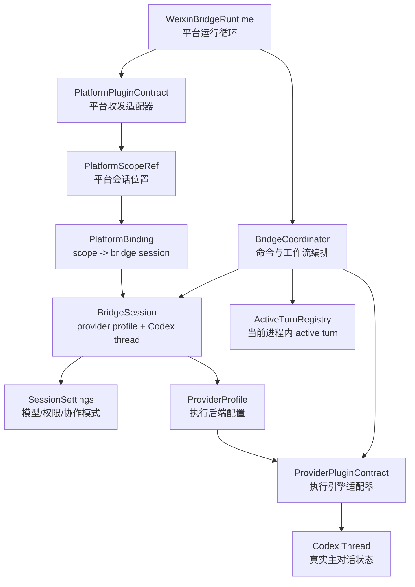

# CodexBridge Concepts and Code Structures

本文把 CodexBridge 代码中的主要 TypeScript interface、type、class 与架构抽象一一对应起来，并解释这些抽象在整体架构和运行流程中的作用。

阅读方式：

- `代码结构` 是仓库里的 interface/type/class 名称。
- `抽象概念` 是它在架构里代表的对象、关系或边界。
- `流程作用` 说明它何时被创建、读取、传递或更新。
- 本文以当前活跃主线 `src/` 为主；`packages/*` 中暂停或抽取中的工作流单独列在后面。

## 1. Concept Map

核心关系：

- `PlatformScopeRef` 定位用户在哪个平台的哪个聊天里说话。
- `PlatformBinding` 把这个平台位置绑定到一个 `BridgeSession`。
- `BridgeSession` 把 Bridge 的会话绑定到真实 `ProviderProfile + codexThreadId`。
- `ProviderPluginContract` 把 Bridge 抽象请求翻译成 Codex app-server 或兼容 provider 请求。
- `ActiveTurnRegistry` 只追踪当前进程正在跑的 turn，不代表持久历史。

## 2. Core Identity and Session Structures

| 代码结构 | 文件 | 抽象概念 | 流程作用 |
| --- | --- | --- | --- |
| `PlatformScopeRef` | `src/types/core.ts` | 平台会话位置 | 用 `platform + externalScopeId` 表示一个微信私聊、Telegram chat/thread 等入口，是所有路由的起点。 |
| `PlatformBinding` | `src/types/repository.ts` | 平台 scope 到 Bridge session 的绑定关系 | Runtime 收到消息后，Coordinator 通过它找到当前 scope 应该继续哪个 `BridgeSession`。 |
| `BridgeSession` | `src/types/core.ts` | Bridge 层的主对话会话 | 包装 `providerProfileId + codexThreadId`，是 CodexBridge 主对话的本地 canonical unit。 |
| `SessionSettings` | `src/types/core.ts` | 会话级运行配置 | 保存 model、reasoning effort、service tier、plan/default mode、personality、approval policy、sandbox mode 等设置。 |
| `ProviderProfile` | `src/types/provider.ts` | 执行后端配置档 | 决定使用哪个 provider plugin、默认模型、环境配置和 provider-specific config。 |
| `ThreadMetadata` | `src/types/core.ts` | Bridge 本地 thread 附加元数据 | 给 provider thread 增加 alias、pin、archive 等 Bridge 自己的目录信息，不替代 provider thread。 |
| `PluginAlias` | `src/types/core.ts` | scope 级插件别名 | 允许用户在某个平台 scope 下给 provider plugin marketplace 的插件设置短别名。 |
| `PlatformScopeRef` + `BridgeSession` | 组合概念 | 当前用户上下文 | 普通消息、`/status`、`/goal`、`/stop`、`/allow` 都从 scope 解析到 session，再进入 provider。 |

这些结构共同解决一个问题：微信不是事实来源，微信只是入口；真实对话状态由 `BridgeSession` 指向的 Codex thread 承担。

## 3. Core Service Classes

| 代码结构 | 文件 | 抽象概念 | 流程作用 |
| --- | --- | --- | --- |
| `PluginRegistry` | `src/runtime/plugin_registry.ts` | 平台/provider 插件注册表 | Runtime 启动时注册 Weixin、Codex、OpenAI-compatible 等插件；Coordinator 通过它按 ID 找实现。 |
| `SessionRouter` | `src/core/session_router.ts` | scope 路由器 | 负责 `PlatformScopeRef -> BridgeSession` 的查找和绑定，保持平台与会话解耦。 |
| `BridgeSessionService` | `src/core/bridge_session_service.ts` | 会话生命周期服务 | 创建、绑定、打开、切换 provider profile、列出 provider threads，并维护 `BridgeSession` 与 settings。 |
| `BridgeCoordinator` | `src/core/bridge_coordinator.ts` | 命令与主工作流编排器 | 解析 slash command、普通消息、provider 调用、approval、stop、artifact、assistant/automation/agent 工作流。 |
| `ActiveTurnRegistry` | `src/core/active_turn_registry.ts` | 当前进程 active turn 表 | 追踪正在运行的 turn、pending approvals、interrupt state、artifact delivery；`/allow`、`/deny`、`/stop` 依赖它。 |
| `AutomationJobService` | `src/core/automation_job_service.ts` | 自动化任务服务 | 管理 `/auto` 创建的定时任务，计算下次运行时间，给 runtime scheduler 调度。 |
| `AgentJobService` | `src/core/agent_job_service.ts` | 长任务服务 | 管理 `/agent` 或 Mission Control 对接的结构化长任务状态。 |
| `AssistantRecordService` | `src/core/assistant_record_service.ts` | 个人记录服务 | 管理 `/as`、`/log`、`/todo`、`/remind`、`/note` 的结构化记录。 |
| `AssistantRecordTodoSourceAdapter` | `src/core/assistant_record_todo_source_adapter.ts` | todo 到 work-item 的适配器 | 把用户 todo 记录投影成可被 Mission Control/agent job 使用的 work item。 |
| `CodexBridgeMissionHostAdapter` | `src/core/mission_control_host_adapter.ts` | Mission Control 到 Bridge host 的适配器 | 让暂停中的 Mission Control 能通过 Bridge 发送进度、审批、通知。 |
| `ProjectingMissionRepository` | `src/core/projecting_mission_repository.ts` | Mission repository 投影包装 | 把 agent job 与 mission 状态同步/投影，属于 Mission Control 集成 seam。 |

这些 service 是核心业务层。平台和 provider 都不应绕过它们直接改 session、active turn 或 workflow state。

## 4. Command and UI State Structures

| 代码结构 | 文件 | 抽象概念 | 流程作用 |
| --- | --- | --- | --- |
| `CommandHelpSpec` | `src/types/command.ts` | slash command 帮助规格 | `/helps` 和 `/<command> -h` 的文案组织单元。 |
| `ThreadBrowserItem` | `src/types/command.ts` | thread 列表中的一行 | `/threads`、`/search`、`/open 2`、`/peek 2` 使用的用户可选项。 |
| `ThreadBrowserPageState` | `src/types/command.ts` | scope 内 thread 浏览分页状态 | 让用户用 `/next`、`/prev`、序号选择，而不是复制原始 thread id。 |
| `DeveloperPromptMode` | `src/types/core.ts` | Bridge 注入给 Codex 的开发者提示模式 | 区分标准 turn、retry recovery、命令技能解析、review 本地化、agent verifier 等 prompt 语境。 |
| `DeveloperPromptContext` | `src/types/core.ts` | 开发者提示上下文 | 记录 command/subcommand/operation，帮助生成更稳定的 provider prompt。 |

这些类型支撑微信的 text-first UX。它们让功能可通过短命令和序号完成，而不是依赖按钮或 UI 状态。

## 5. Platform Contract Structures

| 代码结构 | 文件 | 抽象概念 | 流程作用 |
| --- | --- | --- | --- |
| `InboundAttachmentKind` | `src/types/platform.ts` | 平台入站附件类型 | 把微信图片、语音、文件、视频归一化成 Bridge 可理解的类别。 |
| `InboundAttachment` | `src/types/platform.ts` | 已落地的入站附件 | Runtime 把下载后的本地路径、文件名、mime、转写文本传给 Coordinator/provider。 |
| `InboundTextEvent` | `src/types/platform.ts` | 归一化平台入站消息 | Platform plugin 的核心输出；普通消息和 slash command 都以它进入 Coordinator。 |
| `PlatformDeliveryRequest` | `src/types/platform.ts` | 平台出站投递请求 | `buildTextDeliveries()` 生成的低级出站请求抽象。 |
| `PlatformTextDeliveryResult` | `src/types/platform.ts` | 文本投递结果 | Runtime 判断微信是否成功收到 chunk、失败在哪一段、是否需要降级/提示。 |
| `PlatformMediaDeliveryResult` | `src/types/platform.ts` | 媒体投递结果 | artifact 图片/文件/音视频发送后的结构化结果。 |
| `PlatformStatusInfo` | `src/types/platform.ts` | 平台运行状态快照 | `/status` 展示平台登录、账号、轮询等状态。 |
| `TypingDeliveryRequest` | `src/types/platform.ts` | typing 状态请求 | Runtime 尝试给微信发送“正在输入”状态。 |
| `PlatformPluginContract` | `src/types/platform.ts` | 平台适配器接口 | 定义平台插件必须如何启动、停止、归一化消息、发送文本/媒体/typing。 |

平台 contract 的边界是：只管平台协议，不管 provider routing，不保存 canonical conversation state。

## 6. Weixin Platform Structures

| 代码结构 | 文件 | 抽象概念 | 流程作用 |
| --- | --- | --- | --- |
| `SavedWeixinAccount` | `src/platforms/weixin/account_store.ts` | 已登录微信账号凭据 | `weixin serve` 从本地账号目录读取，用于 iLink 请求鉴权。 |
| `WeixinAccountStore` | `src/platforms/weixin/account_store.ts` | 微信账号文件仓库 | 保存、读取、列出登录账号。 |
| `WeixinConfig` | `src/platforms/weixin/config.ts` | 微信平台配置 | base URL、账号状态目录、bot type 等配置入口。 |
| `WeixinPlatformPlugin` | `src/platforms/weixin/plugin.ts` | 微信平台插件 | 实现 `PlatformPluginContract`，把 iLink 消息变成 `InboundTextEvent`，把 Runtime 输出发回微信。 |
| `WeixinPoller` | `src/platforms/weixin/poller.ts` | 微信长轮询器 | 周期性调用 getupdates，把 Weixin 原始消息交给 runtime。 |
| `WeixinBridgeRuntime` | `src/runtime/weixin_bridge_runtime.ts` | 微信运行时主循环 | 把 poller、coordinator、delivery、automation sweep、long-running command scheduling 接起来。 |
| `StreamingMarkdownFilter` | `src/platforms/weixin/official/markdown_filter.ts` | 微信流式 Markdown 过滤器 | 在发送前处理不适合微信展示的 Markdown 结构，减少破碎代码块/格式污染。 |
| `WeixinSendResponseError` | `src/platforms/weixin/official/send.ts` | 微信发送业务错误 | 当 iLink 返回非成功 ret 时，包装成可识别错误，供 runtime 记录和降级。 |
| `WeixinOfficialTransport` | `src/platforms/weixin/official/transport.ts` | iLink HTTP transport | 封装官方/iLink HTTP 调用、超时、鉴权、错误处理。 |
| `OfficialQrLoginCredentials` | `src/platforms/weixin/official/login.ts` | 微信扫码登录结果 | `weixin login` 成功后写入账号状态。 |
| `CachedConfig` / `WeixinConfigManager` | `src/platforms/weixin/official/config_cache.ts` | 微信远端配置缓存 | 缓存上传、CDN、服务端配置，减少重复请求。 |
| `ProbedMediaInfo` | `src/platforms/weixin/official/media/thumbnail.ts` | 媒体探测结果 | 发送视频/图片前生成缩略图或判断格式时使用。 |

Weixin 低级协议 DTO：

| 代码结构 | 文件 | 抽象概念 | 流程作用 |
| --- | --- | --- | --- |
| `BaseInfo` | `src/platforms/weixin/official/types.ts` | iLink 请求公共头 | 每个官方 API 请求携带的 bot/account 基础信息。 |
| `TextItem` | `src/platforms/weixin/official/types.ts` | 微信文本消息 item | 原始消息中的文本片段。 |
| `CDNMedia` | `src/platforms/weixin/official/types.ts` | 微信 CDN 媒体描述 | 图片/语音/文件/视频下载或上传所需的 CDN 字段。 |
| `ImageItem` / `VoiceItem` / `FileItem` / `VideoItem` | `src/platforms/weixin/official/types.ts` | 微信媒体 item | 原始消息中的不同媒体类型。 |
| `RefMessage` | `src/platforms/weixin/official/types.ts` | 引用消息 | 支持微信 reply/引用消息上下文。 |
| `MessageItem` | `src/platforms/weixin/official/types.ts` | 微信消息 item union | `WeixinMessage` 中的消息内容列表。 |
| `WeixinMessage` | `src/platforms/weixin/official/types.ts` | 微信原始消息 | poller 从 getupdates 得到的业务消息对象。 |
| `GetUpdatesReq` / `GetUpdatesResp` | `src/platforms/weixin/official/types.ts` | 微信长轮询请求/响应 | `WeixinPoller` 的核心协议结构。 |
| `SendMessageReq` / `SendMessageResp` | `src/platforms/weixin/official/types.ts` | 微信发送文本请求/响应 | `sendText()` 最终落到这里。 |
| `SendTypingReq` / `SendTypingResp` | `src/platforms/weixin/official/types.ts` | 微信 typing 请求/响应 | Runtime 发送 typing 状态。 |
| `GetUploadUrlReq` / `GetUploadUrlResp` | `src/platforms/weixin/official/types.ts` | 媒体上传 URL 请求/响应 | artifact/media delivery 上传文件前使用。 |
| `GetConfigReq` / `GetConfigResp` | `src/platforms/weixin/official/types.ts` | 远端配置请求/响应 | 获取 iLink 配置与上传参数。 |
| `WeixinQrCodeResponse` / `WeixinQrStatusResponse` | `src/platforms/weixin/official/types.ts` | 扫码登录协议响应 | `weixin login` 使用。 |

这些 DTO 是协议镜像。它们不应该泄漏到 `core`；必须在 Weixin plugin 层转换成 `InboundTextEvent` 或 delivery result。

## 7. Provider Execution Structures

| 代码结构 | 文件 | 抽象概念 | 流程作用 |
| --- | --- | --- | --- |
| `ProviderInboundAttachmentKind` | `src/types/provider.ts` | provider 侧附件类型 | 平台附件进入 provider 前的归一化类型。 |
| `ProviderTurnAttachment` | `src/types/provider.ts` | provider 输入附件 | `startTurn()` 时附带给 provider 的图片、语音、文件、视频。 |
| `ProviderTurnEvent` | `src/types/provider.ts` | provider 侧入站事件 | 从 `InboundTextEvent` 投影而来，保留 platform/scope/cwd/locale/metadata。 |
| `ProviderTurnSession` | `src/types/provider.ts` | provider 侧 session view | 把 `BridgeSession` 投影给 provider，避免 provider 依赖 core 类型。 |
| `ProviderTurnSessionSettings` | `src/types/provider.ts` | provider 侧 settings view | 把 `SessionSettings` 投影给 provider。 |
| `ProviderThreadStartResult` | `src/types/provider.ts` | provider 新 thread 结果 | `BridgeSessionService.createSessionForScope()` 用它创建 `BridgeSession`。 |
| `ProviderThreadSummary` | `src/types/provider.ts` | provider thread 列表/读取摘要 | `/threads`、`/open`、`/peek`、cold thread 判断、status 展示使用。 |
| `ProviderThreadTurn` | `src/types/provider.ts` | provider thread 中的一个 turn | `readThread(includeTurns)` 返回，用于预览、最终输出、历史回放。 |
| `ProviderThreadTurnItem` | `src/types/provider.ts` | turn 中的一条 item | 抽象 assistant/user/tool/message/file 等历史片段。 |
| `ProviderThreadListResult` | `src/types/provider.ts` | provider thread 分页列表 | 支撑 `/threads` 和 `/search`。 |
| `ProviderTurnProgress` | `src/types/provider.ts` | provider 流式进度 | Runtime 可提前向微信发送 preview/progress。 |
| `ProviderApprovalRequest` | `src/types/provider.ts` | provider 审批请求 | Codex app-server 请求命令执行/patch 等审批时，Bridge 用它提示用户 `/allow`。 |
| `ProviderTurnResult` | `src/types/provider.ts` | provider turn 最终结果 | Coordinator 和 Runtime 判断 final、artifact、错误、partial/missing 状态的主结果。 |
| `ProviderReviewTarget` | `src/types/provider.ts` | review 目标 | `/review` 把 base/head 或 PR/branch 等信息转给 provider。 |
| `ProviderPluginContract` | `src/types/provider.ts` | provider 插件接口 | 所有 provider 必须遵守的执行能力边界。 |

Provider contract 的关键作用是把 core 从 Codex app-server JSON-RPC 细节中隔离出来。Coordinator 只依赖 provider contract，不直接拼 JSON-RPC。

## 8. Provider Artifact Structures

| 代码结构 | 文件 | 抽象概念 | 流程作用 |
| --- | --- | --- | --- |
| `OutputArtifactKind` | `src/types/provider.ts` | provider 输出 artifact 类型 | provider 返回图片、文件、视频、音频时的类型标签。 |
| `OutputArtifact` | `src/types/provider.ts` | provider 原生输出 artifact | `ProviderTurnResult` 中携带，后续由 Bridge 校验和交付。 |
| `ProviderTurnArtifactKind` | `src/types/provider.ts` | artifact delivery 类型 | Bridge/provider artifact 子系统共用的分类。 |
| `ProviderTurnArtifactDeliveredItem` | `src/types/provider.ts` | 已确认可交付 artifact | 记录 path、mime、caption、source、turnId。 |
| `ProviderTurnArtifactRejectedItem` | `src/types/provider.ts` | 被拒绝 artifact | 记录缺失、越界、大小限制、symlink、manifest 错误等原因。 |
| `ProviderTurnArtifactDeliveryState` | `src/types/provider.ts` | provider 侧 artifact 交付状态 | provider result 中的 artifact 状态快照。 |
| `TurnArtifactIntent` | `src/types/core.ts` | 用户 artifact 意图 | 判断用户是否要求生成/返回文件、图片、视频、音频。 |
| `TurnArtifactContext` | `src/types/core.ts` | 单次 turn 的 artifact 工作目录 | 给 provider prompt 和后处理使用，约束 artifact 只能从安全目录交付。 |
| `TurnArtifactDeliveryState` | `src/types/core.ts` | Bridge 侧 artifact 交付状态 | `ActiveTurnRegistry` 挂载它，Runtime 根据它发送媒体或提示缺失。 |

artifact 抽象把“模型生成了什么”和“微信实际发出了什么”分开。这样可以记录 rejected artifacts，而不是静默丢失。

## 9. Native Thread Goal Structures

| 代码结构 | 文件 | 抽象概念 | 流程作用 |
| --- | --- | --- | --- |
| `ProviderThreadGoal` | `src/types/provider.ts` | Codex native thread goal | 表示 objective、status、token budget、tokens used、time used 等原生 goal 状态。 |
| `ProviderThreadGoalFollowResult` | `src/types/provider.ts` | Bridge 跟随原生 goal turn 的结果 | `/goal set/resume` 返回 goal、captured turn result、turnId、threadStatus、是否 resume cold thread。 |
| `CodexGoalSnapshot` | `src/providers/codex/goal_state.ts` | Bridge 本地 goal snapshot | 用于 `/goal` 状态展示和本地状态文件读写。 |
| `CodexGoalManager` | `src/providers/codex/goal_state.ts` | goal state 管理器 | 读取/写入 goal 状态文件，辅助 CLI/Weixin serve 共享状态。 |

`ProviderThreadGoal` 是 provider 层抽象；`CodexGoalSnapshot` 是 CodexBridge/Codex CLI 侧本地状态辅助。`/goal` 的主执行语义必须走 Codex native RPC，而不是 Bridge 自己模拟 goal。

## 10. Codex Provider Specific Structures

| 代码结构 | 文件 | 抽象概念 | 流程作用 |
| --- | --- | --- | --- |
| `CodexAppClient` | `src/providers/codex/app_client.ts` | Codex app-server JSON-RPC client | 启动/连接 app-server，发送 thread/turn/goal/plugin/model/approval 等 RPC，监听通知。 |
| `CodexTextTurnInput` | `src/providers/codex/app_client.ts` | Codex 文本输入块 | 转换用户文本到 Codex turn input。 |
| `CodexLocalImageTurnInput` | `src/providers/codex/app_client.ts` | Codex 本地图片输入块 | 转换微信图片/本地图片到 Codex turn input。 |
| `CodexTurnInput` | `src/providers/codex/app_client.ts` | Codex turn input union | `startTurn()` 拼装 Codex input 数组时使用。 |
| `CodexProviderPlugin` | `src/providers/codex/plugin.ts` | Codex provider contract 实现 | 把 provider contract 方法代理到 `CodexAppClient`。 |
| `OpenAINativeProviderPlugin` | `src/providers/openai_native/plugin.ts` | Codex provider 的原生 OpenAI profile 变体 | 当前继承 Codex provider 行为，用于 profile kind 区分。 |
| `CodexCliLaunchSpec` | `src/providers/codex/cli_command.ts` | Codex CLI 启动规格 | Windows/cmd/sh 启动 app-server 时规整 command/args/options。 |
| `CodexCliReviewStartParams` | `src/providers/codex/review_runner.ts` | Codex CLI review 启动参数 | `/review` 走 CLI review runner 时使用。 |
| `CodexReviewRunnerLike` | `src/providers/codex/review_runner.ts` | review runner 接口 | 测试和实现之间的 seam。 |
| `CodexCliReviewRunner` | `src/providers/codex/review_runner.ts` | Codex CLI review 执行器 | 调用 Codex review 并转换成 provider result。 |

Codex provider 的核心约束：它可以知道 Codex app-server 协议，但不能知道微信投递细节。

## 11. Codex Auth, Account, Feature, and Instruction Structures

| 代码结构 | 文件 | 抽象概念 | 流程作用 |
| --- | --- | --- | --- |
| `CodexAuthIdentity` | `src/providers/codex/auth_state.ts` | Codex 登录身份摘要 | `/status`、native API readiness、account display 使用。 |
| `CodexTokenIdentity` | `src/providers/codex/auth_state.ts` | token 解码身份 | 从 JWT 提取 user/email/subject 等信息。 |
| `CodexAuthTokens` | `src/providers/codex/auth_state.ts` | Codex auth token bundle | 读取 `~/.codex/auth.json` 后的 token 结构。 |
| `CodexAuthState` | `src/providers/codex/auth_state.ts` | Codex auth 文件状态 | 表示 auth 文件是否存在、可读、包含哪些 token。 |
| `WriteCodexAuthOptions` | `src/providers/codex/auth_state.ts` | 写 auth 文件选项 | 登录/刷新 auth 时控制写入。 |
| `CodexAccountSummary` | `src/providers/codex/account_manager.ts` | Codex 账号摘要 | `/login list` 等命令展示账号状态。 |
| `CodexPendingLoginSummary` | `src/providers/codex/account_manager.ts` | 待完成登录摘要 | 设备码/网页登录流程中展示 pending 状态。 |
| `CodexPendingLoginRefreshResult` | `src/providers/codex/account_manager.ts` | pending login 刷新结果 union | 表示 completed、pending、expired、failed 四类刷新结果。 |
| `CodexAccountManager` | `src/providers/codex/account_manager.ts` | Codex 账号管理器 | 管理登录、账号列表、pending login、auth state。 |
| `CodexCredentialStore` | `src/providers/codex/credential_store.ts` | Codex credential 存储接口 | 抽象 secret-tool 或 encrypted-file 两类 credential store。 |
| `SecretToolCodexCredentialStore` | `src/providers/codex/credential_store.ts` | secret-tool credential store | Linux/系统 secret-tool 风格凭据读取写入。 |
| `EncryptedFileCodexCredentialStore` | `src/providers/codex/credential_store.ts` | 加密文件 credential store | 文件型凭据存储 fallback。 |
| `CodexExperimentalFeatureInfo` | `src/providers/codex/experimental_features_manager.ts` | Codex experimental feature 状态 | `/experimental list/on/off` 展示或切换 feature。 |
| `CodexExperimentalFeaturesManager` | `src/providers/codex/experimental_features_manager.ts` | feature 管理器 | 调用 Codex CLI features，解析 feature catalog。 |
| `CodexInstructionsSnapshot` | `src/providers/codex/instructions_state.ts` | instructions 文件快照 | `/instructions` 展示和编辑当前自定义 instructions。 |
| `CodexInstructionsManager` | `src/providers/codex/instructions_state.ts` | instructions 管理器 | 读取、写入、定位 Codex instructions 文件。 |
| `OpenAIDeviceLoginStart` / `OpenAITokenBundle` / `OpenAIDeviceLoginRefreshResult` | `src/providers/codex/oauth_device.ts` | OpenAI/Codex 设备登录协议结构 | Codex 登录流程中的设备码、token、刷新结果。 |

这些结构属于 Codex 账号和本地环境层。它们支持 Bridge 使用“已登录本地 Codex”，但不直接参与主消息 turn 的业务编排。

## 12. OpenAI-Compatible Structures

| 代码结构 | 文件 | 抽象概念 | 流程作用 |
| --- | --- | --- | --- |
| `OpenAICompatibleProviderProfile` | `src/providers/openai_compatible/plugin.ts` | OpenAI-compatible profile 类型 | 在 `ProviderProfile` 上约束 compatible provider config。 |
| `OpenAICompatibleProviderDefaults` | `src/providers/openai_compatible/plugin.ts` | compatible provider 默认值 | base URL、model、env key 等默认配置。 |
| `OpenAICompatibleProviderPluginOptions` | `src/providers/openai_compatible/plugin.ts` | compatible provider plugin 构造选项 | 测试和运行时注入 adapter/client。 |
| `OpenAICompatibleProviderPlugin` | `src/providers/openai_compatible/plugin.ts` | OpenAI-compatible provider 实现 | 通过本地 Responses adapter 让 Codex app-server 调用兼容模型。 |
| `ResponsesWebSocketRepairState` | `src/providers/openai_compatible/responses_websocket_repair.ts` | WebSocket transcript 修复状态 | 修复 Responses WebSocket 中 tool call/previous response 兼容问题。 |
| `ResponsesWebSocketNormalizeResult` | `src/providers/openai_compatible/responses_websocket_repair.ts` | WebSocket 请求归一化结果 | 表示请求是否被替换、修复、保留。 |
| `ResponsesWebSocketToolRepairCache` | `src/providers/openai_compatible/responses_websocket_repair.ts` | tool call 修复缓存 | 缓存 synthetic call id 和历史 tool call 对应关系。 |
| `ResponsesWebSocketRepairError` | `src/providers/openai_compatible/responses_websocket_repair.ts` | WebSocket 修复错误 | compatible adapter 发现无法修复时抛出。 |

OpenAI-compatible 抽象的作用是把“非 OpenAI 后端的差异”压到 capability data 和 adapter 层，不让 core 出现 provider-specific 分支。

## 13. Native API and Side-Task Structures

| 代码结构 | 文件 | 抽象概念 | 流程作用 |
| --- | --- | --- | --- |
| `CodexNativeInboundAttachment` | `packages/codex-native-api/src/native_api_types.ts` | Native API 入站附件 | localhost API 或 Bridge side-task lane 的附件输入。 |
| `CodexNativeInboundEvent` | `packages/codex-native-api/src/native_api_types.ts` | Native API 入站事件 | side task 调用 Codex 时的事件包装。 |
| `CodexNativeSession` | `packages/codex-native-api/src/native_api_types.ts` | Native API 隔离 session | side-task lane 中的 Codex session，不污染主 bridge session。 |
| `CodexNativeSessionSettings` | `packages/codex-native-api/src/native_api_types.ts` | Native API session settings | side-task lane 的 model、权限、sandbox、locale 等设置。 |
| `CodexNativeApiContinuationEntry` | `packages/codex-native-api/src/native_api_continuation_registry.ts` | `response_id` continuation 记录 | 把 API 层 `response_id` 映射到底层 native thread/session。 |
| `CodexNativeApiContinuationLookupResult` | `packages/codex-native-api/src/native_api_continuation_registry.ts` | continuation 查询结果 | 表示 found/missing/expired。 |
| `CodexNativeApiContinuationRegistryDescriptor` | `packages/codex-native-api/src/native_api_continuation_registry.ts` | continuation registry 能力描述 | 标明 in-process/persistent、TTL 等语义。 |
| `CodexNativeApiContinuationRegistry` | `packages/codex-native-api/src/native_api_continuation_registry.ts` | continuation registry 接口 | Native API 服务用它管理 `previous_response_id`。 |
| `InMemoryCodexNativeApiContinuationRegistry` | `packages/codex-native-api/src/native_api_continuation_registry.ts` | 进程内 continuation registry | 当前默认实现，重启后 continuation 丢失。 |
| `CodexNativeRuntimeReadiness` | `packages/codex-native-api/src/native_runtime.ts` | native runtime readiness | `/v1/health` 或 side-task routing 判断 Codex 是否可用。 |
| `CodexNativeRuntimeTurnPreparation` | `packages/codex-native-api/src/native_runtime.ts` | native turn 准备请求 | 描述 inputText、developer instructions、权限、metadata。 |
| `CodexNativeRuntimeTurnResult` | `packages/codex-native-api/src/native_runtime.ts` | native turn 执行结果 | 返回 side-task session、provider result、原始请求。 |
| `CodexNativeRuntimeTurnStartedMeta` | `packages/codex-native-api/src/native_runtime.ts` | native turn start 元数据 | progress hook 用它暴露 threadId/turnId/sessionId。 |
| `CodexNativeRuntimeTurnHooks` | `packages/codex-native-api/src/native_runtime.ts` | native turn hook | side-task lane 的 progress 和 turn-start callback。 |
| `CodexNativeRuntimeReconnectResult` / `CodexNativeRuntimeReconnectSummary` | `packages/codex-native-api/src/native_runtime.ts` | native runtime 重连结果 | `/reconnect` 或 native API service readiness refresh 使用。 |
| `CodexNativeRuntimeRunTurnOptions` / `CodexNativeRuntimeContinuationTurnOptions` | `packages/codex-native-api/src/native_runtime.ts` | native turn 执行选项 | 新建 isolated turn 或 continuation turn 的参数集合。 |
| `CodexNativeRuntime` | `packages/codex-native-api/src/native_runtime.ts` | logged-in Codex side-task runtime | 封装隔离 thread 创建、turn 执行、readiness、continuation。 |
| `CodexNativeApiServer` | `packages/codex-native-api/src/native_api_server.ts` | localhost API server | 暴露 `/v1/health`、`/v1/models`、`/v1/responses` 等 API。 |
| `CodexNativeApiService` | `packages/codex-native-api/src/native_api_service.ts` | Native API service 生命周期 | 管理 provider binding、host/port/auth、server start/stop。 |
| `CodexNativeApiSideTaskRouter` | `packages/codex-native-api/src/native_api_side_task_router.ts` | side-task route policy | 在 native API 和 direct native isolated execution 之间选择路线。 |

Native API lane 的抽象作用是：用本地已登录 Codex 执行隔离任务，但不污染主微信会话 thread。

## 14. Assistant Record Structures

| 代码结构 | 文件 | 抽象概念 | 流程作用 |
| --- | --- | --- | --- |
| `AssistantRecordType` | `src/types/core.ts` | 个人记录类型 | log、todo、reminder、note、uncategorized。 |
| `AssistantRecordStatus` | `src/types/core.ts` | 个人记录状态 | pending、active、done、cancelled、archived。 |
| `AssistantRecordPriority` | `src/types/core.ts` | 个人记录优先级 | low、normal、high。 |
| `AssistantRecordParseStatus` | `src/types/core.ts` | 解析状态 | auto、confirmed、edited，区分 Codex/本地解析和用户确认。 |
| `AssistantAttachmentKind` | `src/types/core.ts` | 记录附件类型 | image、video、audio、document、archive、other。 |
| `AssistantAttachment` | `src/types/core.ts` | 个人记录附件 | `/as`、`/todo` 等命令附带文件时归档到本地并记录 metadata。 |
| `AssistantRecord` | `src/types/core.ts` | 个人助理记录 | 用户的日志、待办、提醒、笔记的 canonical Bridge-owned record。 |
| `AssistantRecordDraft` | `src/core/assistant_record_service.ts` | 待确认记录草稿 | `/as` 解析后等待 `/as ok` 或 `/as edit` 前的中间状态。 |

assistant records 是 Bridge-owned domain。Codex 可帮助理解自然语言，但 record 生命周期和持久化由 Bridge 控制。

## 15. Upload Structures

| 代码结构 | 文件 | 抽象概念 | 流程作用 |
| --- | --- | --- | --- |
| `UploadBatchItem` | `src/types/core.ts` | 单个上传暂存项 | 用户在微信上传图片/文件/语音后，Bridge 暂存本地路径和元数据。 |
| `UploadBatchState` | `src/types/core.ts` | 上传批次状态 | 支持用户先发附件再用 `/up`、`/as`、普通消息消费这一批附件。 |

upload batch 是平台附件进入 provider/assistant record 前的缓冲层。

## 16. Automation Structures

| 代码结构 | 文件 | 抽象概念 | 流程作用 |
| --- | --- | --- | --- |
| `AutomationMode` | `src/types/core.ts` | 自动化运行模式 | standalone 或 thread，决定任务是否绑定主对话 thread。 |
| `AutomationStatus` | `src/types/core.ts` | 自动化状态 | active 或 paused。 |
| `AutomationSchedule` | `src/types/core.ts` | 自动化时间计划 | interval、daily、cron 三类调度表达。 |
| `AutomationJob` | `src/types/core.ts` | 自动化任务 | `/auto` 创建的定时任务，记录 prompt、scope、session、schedule、运行结果。 |

automation job 是 Bridge-owned scheduled workflow。Runtime scheduler 根据它触发 Codex 执行并把结果投递回原 scope。

## 17. Agent Job and Mission Projection Structures

| 代码结构 | 文件 | 抽象概念 | 流程作用 |
| --- | --- | --- | --- |
| `AgentJobCategory` | `src/types/core.ts` | agent job 分类 | code、research、ops、doc、media、mixed。 |
| `AgentJobRiskLevel` | `src/types/core.ts` | agent job 风险等级 | 决定确认、审批、执行策略。 |
| `AgentJobMode` | `src/types/core.ts` | agent job 执行模式 | codex、agents、hybrid。 |
| `AgentJobLoopPolicy` | `src/types/core.ts` | agent job 循环限制 | max attempts、turns、cycles、no-progress cycles。 |
| `AgentJobStatus` | `src/types/core.ts` | agent job 生命周期状态 | queued/running/verifying/repairing/completed/failed/stopped 等。 |
| `MissionRuntimeStateSnapshot` | `src/types/core.ts` | Mission runtime 快照 | 把 Mission Control 状态嵌入 agent job。 |
| `MissionAttemptHistoryEntry` | `src/types/core.ts` | Mission attempt 历史 | 记录每次 verifier/result/error。 |
| `AgentJob` | `src/types/core.ts` | Bridge 长任务 | 用户发起的结构化长任务，可能投影到 Mission Control 工作流。 |
| `AgentJobMissionRuntimeStateView` | `src/core/mission_control_agent_job_adapter.ts` | agent job 的 mission state view | Bridge 与 Mission Control 之间的状态转换视图。 |
| `AgentJobMissionRepository` | `src/core/mission_control_agent_job_repository.ts` | agent job backed mission repository | 用 agent job 存储实现 MissionRepository 接口。 |
| `CodexBridgeMissionHostAdapter` | `src/core/mission_control_host_adapter.ts` | Bridge 作为 Mission host | Mission Control 需要通知用户、请求审批、发布 artifact 时通过它回到 Bridge。 |

Agent/Mission 是较高层工作流，目前不是主线产品中心。新代码应避免无意扩大 Mission Control 范围。

## 18. Repository Structures

| 代码结构 | 文件 | 抽象概念 | 流程作用 |
| --- | --- | --- | --- |
| `ProviderProfileRepository` | `src/types/repository.ts` | provider profile 仓库接口 | 保存和读取 provider profiles。 |
| `BridgeSessionRepository` | `src/types/repository.ts` | bridge session 仓库接口 | 保存、读取、列出 `BridgeSession`。 |
| `PlatformBindingRepository` | `src/types/repository.ts` | platform binding 仓库接口 | 保存和读取 scope binding。 |
| `SessionSettingsRepository` | `src/types/repository.ts` | session settings 仓库接口 | 保存和读取 session 配置。 |
| `ThreadMetadataRepository` | `src/types/repository.ts` | thread metadata 仓库接口 | 保存和读取 alias/pin/archive。 |
| `PluginAliasRepository` | `src/types/repository.ts` | plugin alias 仓库接口 | 保存 scope 级插件别名。 |
| `AutomationJobRepository` | `src/types/repository.ts` | automation job 仓库接口 | 保存 `/auto` 任务。 |
| `AgentJobRepository` | `src/types/repository.ts` | agent job 仓库接口 | 保存长任务。 |
| `AssistantRecordRepository` | `src/types/repository.ts` | assistant record 仓库接口 | 保存个人记录。 |
| `JsonFileStore<T>` | `src/store/file_json/json_file_store.ts` | JSON 文件存储基类 | file-json repositories 的底层读写原语。 |
| `InMemory*Repository` | `src/store/in_memory/*` | 内存仓库实现 | 测试和临时 runtime 使用。 |
| `FileJson*Repository` | `src/store/file_json/*` | JSON 文件仓库实现 | `weixin serve` 默认持久化实现。 |

仓库层的作用是把核心服务从存储介质中隔离出来。新增持久对象应先定义 repository contract，再写 in-memory/file-json 两套实现。

## 19. Runtime, Bootstrap, and Error Structures

| 代码结构 | 文件 | 抽象概念 | 流程作用 |
| --- | --- | --- | --- |
| `createCodexBridgeRuntime()` | `src/runtime/bootstrap.ts` | runtime object graph factory | 把 repositories、services、plugins、coordinator、activeTurns 组装成完整 Bridge runtime。 |
| `WeixinBridgeRuntime` | `src/runtime/weixin_bridge_runtime.ts` | 微信运行时 | 启动 poller、处理事件、调度后台命令、发送 progress/final/typing/media。 |
| `PluginRegistry` | `src/runtime/plugin_registry.ts` | 插件注册表 | 让 runtime/coordinator 可以按 platform/provider kind 查插件。 |
| `CodexBridgeError` | `src/core/errors.ts` | Bridge 基础领域错误 | 所有可归类 Bridge 错误的基类。 |
| `NotFoundError` | `src/core/errors.ts` | 找不到资源 | provider profile、bridge session、thread、scope binding 缺失时使用。 |
| `ConfigurationError` | `src/core/errors.ts` | 配置错误 | provider config、Weixin config、环境变量不合法时使用。 |
| `Translator` | `src/i18n/index.ts` | i18n 翻译器 | 所有用户可见文本应通过它生成。 |
| `SupportedLocale` | `src/i18n/index.ts` | 支持语言 | 当前是 `zh-CN` 和 `en`。 |

Runtime 层不应该拥有业务状态；它拥有的是循环、调度、投递和错误边界。

## 20. Package Workstream Structures

这些结构属于暂停或抽取中的包级工作流。它们对理解项目有帮助，但不应在普通 CodexBridge 修复中随意扩张。

### 20.1 Mission Control

| 代码结构 | 文件 | 抽象概念 | 流程作用 |
| --- | --- | --- | --- |
| `Mission` | `packages/mission-control/src/types.ts` | 长任务聚合根 | 表示一个可规划、执行、验证、重试、归档的任务。 |
| `WorkItem` | `packages/mission-control/src/types.ts` | 外部工作项 | 从 todo、issue、manual input 等来源进入 Mission。 |
| `ChecklistItem` / `ChecklistSnapshot` | `packages/mission-control/src/types.ts` | 验收清单 | 将目标拆成可验证项，供 verifier 判断是否完成。 |
| `MissionGeneration` | `packages/mission-control/src/types.ts` | 一代 mission plan | retry/resume 后产生新 generation，保留 lineage。 |
| `MissionAttempt` | `packages/mission-control/src/types.ts` | 一次执行尝试 | 记录 provider run、verifier verdict、错误和输出。 |
| `PlanChangeRequest` | `packages/mission-control/src/types.ts` | 计划变更请求 | 当执行中需要改变目标/验收标准/计划时使用。 |
| `MissionPendingApproval` | `packages/mission-control/src/types.ts` | mission 审批请求 | 长任务工作流内部的审批模型。 |
| `MissionLease` | `packages/mission-control/src/types.ts` | mission 运行 lease | 防止多个 runner 同时处理同一 mission。 |
| `MissionWorkpad` | `packages/mission-control/src/types.ts` | mission 工作台摘要 | 保存 latest plan、blocker、verifier summary、final summary。 |
| `MissionEvent` | `packages/mission-control/src/types.ts` | mission timeline event | 记录状态变更、progress、lease、attempt 等事件。 |
| `MissionRepository` | `packages/mission-control/src/repository.ts` | mission 仓库接口 | Mission Control 的持久化边界。 |
| `MissionRuntime` | `packages/mission-control/src/runtime.ts` | mission 执行循环 | 调用 provider、verifier、repository 完成任务循环。 |
| `MissionSupervisor` | `packages/mission-control/src/supervision.ts` | mission 监督器 | 扫描可运行 mission 并驱动 runtime。 |

### 20.2 Codex Gateway

| 代码结构 | 文件 | 抽象概念 | 流程作用 |
| --- | --- | --- | --- |
| `ResponsesToChatOptions` / `ChatToResponsesOptions` | `packages/codex-gateway/src/converters/responses_adapter.ts` | Responses/Chat 转换选项 | OpenAI-compatible gateway 的协议转换配置。 |
| `OpenAICompatibleProviderPreset` | `packages/codex-gateway/src/capabilities/capability_presets.ts` | compatible provider capability preset | 用数据描述 provider/model 差异。 |
| `OpenAICompatibleModelCapabilities` | `packages/codex-gateway/src/capabilities/thinking_policy.ts` | 模型能力描述 | thinking、payload、tool、multimodal、usage、retry 等能力数据。 |
| `CodexGatewayProtocolBoundaryDecision` | `packages/codex-gateway/src/capabilities/protocol_boundary.ts` | gateway 协议边界判定 | 决定某请求应走 Responses、Chat Completions 或拒绝。 |
| `OpenAICompatibleResponsesAdapterServer` | `packages/codex-gateway/src/server/responses_adapter_server.ts` | compatible Responses server | 把 compatible backend 暴露成 Codex 可调用的 Responses-like API。 |

Codex Gateway 是 OpenAI-compatible provider 实验的包化方向，目前不是主线闭环。

## 21. End-to-End Flow by Structures

### 21.1 Normal message flow

| 阶段 | 关键结构 | 作用 |
| --- | --- | --- |
| 微信拉取消息 | `WeixinMessage`, `GetUpdatesResp`, `WeixinPoller` | 从 iLink 获取原始消息。 |
| 平台归一化 | `WeixinPlatformPlugin`, `InboundTextEvent`, `InboundAttachment` | 把微信协议转换成 Bridge 入站事件。 |
| scope 路由 | `PlatformScopeRef`, `PlatformBinding`, `SessionRouter` | 找到当前微信聊天绑定的 Bridge session。 |
| session 解析 | `BridgeSession`, `SessionSettings`, `BridgeSessionService` | 得到 provider profile、Codex thread、模型和权限设置。 |
| provider 调用 | `ProviderPluginContract`, `ProviderTurnEvent`, `ProviderTurnSession` | 启动或继续 provider turn。 |
| active turn | `ActiveTurnRegistry`, `ProviderApprovalRequest` | 记录 turnId、pending approval、可中断状态。 |
| provider 输出 | `ProviderTurnProgress`, `ProviderTurnResult`, `OutputArtifact` | 接收 progress、final、artifact、error。 |
| 微信交付 | `PlatformTextDeliveryResult`, `PlatformMediaDeliveryResult`, `WeixinBridgeRuntime` | 分段发送文本和媒体，记录投递失败。 |

### 21.2 Native `/goal` flow

| 阶段 | 关键结构 | 作用 |
| --- | --- | --- |
| 用户命令 | `InboundTextEvent`, `BridgeCoordinator` | 解析 `/goal set/resume/pause/status/clear`。 |
| 读取 session | `BridgeSession`, `ProviderProfile` | 确定哪个 Codex thread 的 goal 被修改。 |
| 设置 goal | `ProviderThreadGoal`, `setThreadGoalAndFollow()` | 调用 Codex native `thread/goal/set`。 |
| 捕获 turn | `ProviderThreadGoalFollowResult`, `ActiveTurnRegistry` | 捕获 native `turn/started`，写入 active turn。 |
| cold thread resume | `ProviderThreadSummary.status`, `resumeThread()` | 如果 thread 是 notLoaded/unknown，调用 native resume 再继续监听。 |
| 审批 | `ProviderApprovalRequest`, `/allow`, `/deny` | Native goal turn 的审批与普通 turn 等价。 |
| 结束 | `ProviderTurnResult`, `ProviderThreadGoal` | final 回微信，Codex native goal 自己更新 completion 状态。 |

### 21.3 `/stop` and approval flow

| 阶段 | 关键结构 | 作用 |
| --- | --- | --- |
| 注册 active turn | `ActiveTurnRegistry.beginScopeTurn()` | turn 开始时记录 scope/thread/turn。 |
| approval 到达 | `ProviderApprovalRequest` | provider callback 把审批加入 active turn。 |
| 用户批准 | `/allow 1`, `respondToApproval()` | Coordinator 找到 pending approval 并发回 provider。 |
| 用户拒绝 | `/deny`, `respondToApproval()` | 用拒绝选项解决 provider request。 |
| 用户停止 | `/stop`, `interruptTurn()` | 标记 interrupt 并向 provider 派发中断。 |
| 清理 | `ActiveTurnRegistry.endScopeTurn()` | turn 完成、失败或中断后释放进程内状态。 |

## 22. Ownership Rules

| 抽象 | 拥有者 | 不应由谁修改 |
| --- | --- | --- |
| `BridgeSession` | `BridgeSessionService` | Platform plugin、provider plugin |
| `PlatformBinding` | `SessionRouter` / `BridgeSessionService` | Provider plugin |
| `SessionSettings` | `BridgeSessionService` / Coordinator command handlers | Platform plugin |
| `ActiveTurnRegistry` | `BridgeCoordinator` / Runtime callback path | Provider plugin 直接持久化 |
| `ProviderThreadGoal` | Codex provider / Codex app-server | Bridge 本地模拟 native goal 状态 |
| `AssistantRecord` | `AssistantRecordService` | Provider plugin |
| `AutomationJob` | `AutomationJobService` | Platform plugin |
| `AgentJob` | `AgentJobService` | Provider plugin |
| `WeixinMessage` / iLink DTO | Weixin platform layer | Core/provider |
| `ProviderTurnResult` | Provider plugin | Platform plugin |

## 23. Design Checks for Future Changes

新增或修改代码时，用下面的问题检查是否和架构对齐：

1. 这个新结构代表的是平台协议、核心业务、provider 执行，还是持久化记录？
2. 它是否被放在对应的 `platforms/`、`core/`、`providers/`、`store/`、`runtime/` 层？
3. 如果它是持久化对象，是否有 repository contract、in-memory repo、file-json repo 和测试？
4. 如果它会启动长任务，是否会注册 active turn，并保证 `/allow`、`/deny`、`/stop` 不被阻塞？
5. 如果它会给微信返回内容，是否有失败可见结果，而不是静默？
6. 如果它依赖 Codex app-server live state，是否区分了 persisted state 和 process-local state？
7. 如果它涉及 provider profile，是否避免把不同 provider 的 thread 混入同一个 session？
8. 如果它是 package workstream，是否确认该 package 当前不是暂停状态，或用户明确要求恢复？

## 24. Related Documents

- [Architecture and design baseline](./codexbridge-architecture-and-design.md)
- [Core architecture](./codexbridge-core-architecture.md)
- [Codex Native API](./codex-native-api.md)
- [Weixin delivery best practice](./weixin-delivery-best-practice.md)
- [Weixin slash commands](../usage/weixin-slash-commands.md)
